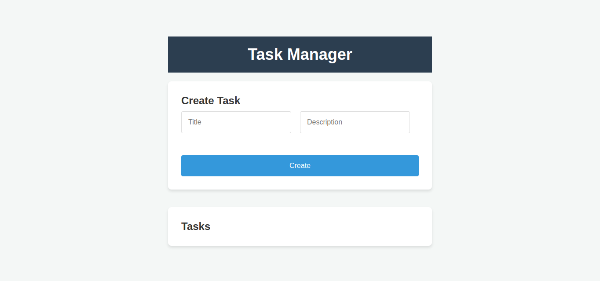

# Task Manager
The Task Manager app tool is designed to simplify task management with CRUD operation: creation, deletion, and modification of tasks. Users can easily generate new tasks, remove completed ones, and update task details.

### Built With:
- **React**
- **Node Js**
- **Express**

# Demo

## Getting Started

Follow the steps below to set up and run the Task Manager app locally.

## Prerequisites
Make sure you have the following installed on your system:
- **Node.js**
- **Yarn**

# Execution
## Backend:
cd server

npm install

npm start

## Frontend:
cd client

yarn 

yarn dev

## Configuring Environment Variables (.env)
### Frontend:
Create a .env file in the client directory with the following content:

VITE_API_URL=URL_of_your_backend_server_here
